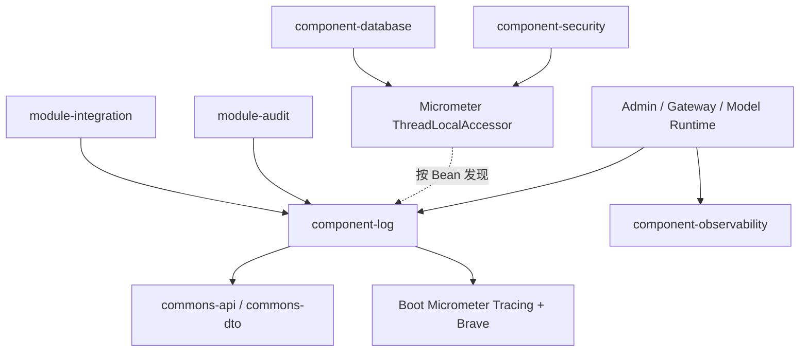
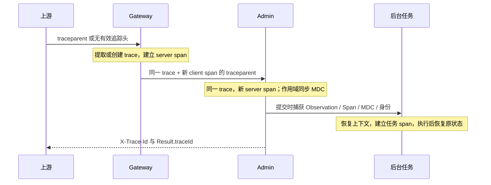

# 日志组件与链路上下文设计

状态：已实现，测试与运行边界见本文末尾。设计日期：2026-10-05。

## 1. 目标与职责

三个 Java 服务共用 `hucoo-component-log`：Admin、Gateway、Model Runtime。维护真实的 trace/span，使请求日志、响应关联、异步任务和下游 HTTP 调用使用一致的链路。没有请求上下文的启动、关闭和第三方后台日志允许缺失 ID，不生成没有业务含义的占位链路。

| 模块 | 职责 |
| --- | --- |
| component-log | Logback 共享配置、Micrometer Tracing + Brave、MDC 上下文、任务包装、HTTP 响应关联 |
| component-observability | MeterRegistry 公共标签、Prometheus、Actuator 等指标能力 |
| component-web | 请求访问日志、统一响应和异常处理；读取当前 traceId，不生成或清理它 |
| component-security / database | 在各自组件中声明当前用户、租户 ThreadLocalAccessor |
| module-audit | 业务审计实体与持久化；日志组件不替代审计日志 |



log 不依赖 web、security、database 或任何业务模块。Servlet / WebFlux starter 仅用于可选适配代码编译，不传递给使用者；按应用类型装配各自响应过滤器。Gateway 的运行时依赖不能包含 Servlet MVC。

组件只通过 `META-INF/spring/org.springframework.boot.autoconfigure.AutoConfiguration.imports` 激活。日志初始化早于 Spring Bean 创建，默认属性通过 `EnvironmentPostProcessor` 的低优先级 PropertySource 提供；用户配置优先。共享 XML 由服务启动资源显式引用，不靠组件扫描。

## 2. Logback 配置

原示例需要修正：

1. 文件必须为 `logback-spring.xml`，支持 springProperty/springProfile；不启用 scan。
2. prod 原示例只有文件输出，与“控制台也留一份”的注释不一致。
3. 增加 test、其他 profile 和无 profile 的控制台兜底。
4. `%X{traceId:-}` 的默认值是空字符串。显示横杠应写 `%X{traceId:--}`，spanId 同理。
5. 增加 UTF-8、应用名默认值、gzip 和归档磁盘上限。
6. Boot 4 已提供 Logstash 格式的 `StructuredLogEncoder`，无需额外引入 logstash-logback-encoder。

三个服务的 `logback-spring.xml` 均为：

```xml
<?xml version="1.0" encoding="UTF-8"?>
<configuration>
    <include resource="dev/hucoo/component/log/logback-shared.xml"/>
</configuration>
```

共享 XML 的完整内容：

```xml
<?xml version="1.0" encoding="UTF-8"?>
<included>
    <springProperty scope="context" name="APP_NAME" source="spring.application.name" defaultValue="application"/>
    <springProperty scope="context" name="LOG_DIR" source="logging.file.path" defaultValue="logs"/>
    <appender name="CONSOLE" class="ch.qos.logback.core.ConsoleAppender">
        <encoder>
            <charset>UTF-8</charset>
            <pattern>%d{HH:mm:ss.SSS} %5p [${APP_NAME},%X{traceId:--},%X{spanId:--}] --- [%t] %logger{36} : %m%n</pattern>
        </encoder>
    </appender>
    <springProfile name="prod">
        <appender name="JSON_FILE" class="ch.qos.logback.core.rolling.RollingFileAppender">
            <file>${LOG_DIR}/${APP_NAME}.json</file>
            <encoder class="org.springframework.boot.logging.logback.StructuredLogEncoder">
                <format>logstash</format>
                <charset>UTF-8</charset>
            </encoder>
            <rollingPolicy class="ch.qos.logback.core.rolling.SizeAndTimeBasedRollingPolicy">
                <fileNamePattern>${LOG_DIR}/${APP_NAME}.%d{yyyy-MM-dd}.%i.json.gz</fileNamePattern>
                <maxFileSize>100MB</maxFileSize>
                <maxHistory>15</maxHistory>
                <totalSizeCap>2GB</totalSizeCap>
            </rollingPolicy>
        </appender>
        <logger name="dev.hucoo" level="INFO"/>
        <root level="INFO"><appender-ref ref="CONSOLE"/><appender-ref ref="JSON_FILE"/></root>
    </springProfile>
    <springProfile name="dev &amp; !prod">
        <logger name="dev.hucoo" level="DEBUG"/>
        <root level="INFO"><appender-ref ref="CONSOLE"/></root>
    </springProfile>
    <springProfile name="!dev &amp; !prod">
        <root level="INFO"><appender-ref ref="CONSOLE"/></root>
    </springProfile>
</included>
```

| 配置项 | 默认值 / 含义 |
| --- | --- |
| spring.application.name | service 字段及文件名；缺失时 application |
| logging.file.path | logs，相对进程工作目录；生产可设置绝对目录 |
| agent-platform.logging.environment | JSON env 默认 prod，可显式覆盖 |
| management.tracing.propagation.consume / produce | W3C；沿用 Boot 配置可覆盖 |
| management.tracing.sampling.probability | 沿用 Boot 的 0.1；未采样链路仍有真实 ID |
| spring.reactor.context-propagation | auto |
| spring.task.execution.mode | force，避免审计/熔断 Executor Bean 使 Boot 默认执行器退让 |
| logging.structured.json.context.include | false，关闭内置任意 MDC / fluent key-value 输出 |
| logging.structured.json.customizer | TraceJsonMembersCustomizer，补充 service/env/traceId/spanId |

业务级别由共享 XML 统一维护：dev 是 DEBUG、其他是 INFO；框架默认 INFO。激活 prod 与 dev 时 prod 优先。既有 YAML 的重复业务级别已移除。运维仍可用 `logging.level.*` 显式覆盖级别。

APP_NAME/env 是应用配置，不放入 MDC。MDC 可用于本地业务关联，JSON 默认只输出 tracing 的两个字段；不要将凭证、完整请求体或敏感身份写入 MDC。替换 JSON customizer / context.include 会改变这一输出约定。

控制台样例：

```text
10:25:30.123  INFO [hucoo-application-admin,0123456789abcdef0123456789abcdef,abcdef0123456789] --- [virtual-42] d.h.example.Service : update completed
10:25:30.124  INFO [hucoo-application-admin,-,-] --- [main] d.h.admin.AdminApplication : application started
```

生产文件是一行一个 JSON 对象，异常和消息中的换行由编码器转义：

```json
{"@timestamp":"2026-10-05T10:25:30.123+08:00","@version":"1","message":"update completed","logger_name":"dev.hucoo.example.Service","thread_name":"virtual-42","level":"INFO","level_value":20000,"service":"hucoo-application-admin","env":"prod","traceId":"0123456789abcdef0123456789abcdef","spanId":"abcdef0123456789"}
```

无 trace/span 时 JSON 省略对应字段。异常增加 stack_trace。默认日志文件为 `logs/<service>.json`；100MB 或跨日时滚动，归档为 `<service>.<yyyy-MM-dd>.<index>.json.gz`，保留 15 天，归档总量上限 2GB。总量上限不包含当前活动文件，也不包含其他服务的日志；服务多实例应使用各自独立目录/卷，不能并发写同一个文件。

## 3. HTTP 与跨服务链路



- Boot HTTP observation 负责建立 server/client span；Brave 的 MDC scope decorator 拥有 traceId/spanId。业务过滤器不能自行生成 ID，也不能简单在 finally 中删除这些字段。
- 同一链路 traceId 相同，各个 server/client/task span 的 spanId 不同。标准 W3C traceId 为 32 位十六进制，spanId 为 16 位。
- 入站仅使用标准有效追踪头。无效头或只有 X-Trace-Id 时重新建立 trace；X-Trace-Id 不作为可信链路入口。traceId 只是诊断信息，不用于授权。
- 响应继续提供 X-Trace-Id，Admin 统一 Result 继续填充 traceId。Gateway 自身 401 Result 也使用当前 traceId。业务 REST 结构不变。
- Servlet 的响应过滤器运行在 Boot HTTP observation 之后，覆盖 REQUEST/ASYNC/ERROR，错误派发复用请求中保存的 span。RequestLogFilter 仅记录访问日志，异步请求在结束派发时记录。
- Reactive 响应过滤器读取 Reactor 中的 server Observation。Gateway 的结束日志在订阅时捕获上下文，并在 doFinally 中显式恢复，覆盖成功、失败和取消。
- 模型服务客户端使用 Boot 配置过的 WebClient.Builder。Feign 加入 feign-micrometer，自动注册 observation capability；集成模块为熔断执行器提供上下文包装，避免 TimeLimiter 切线程后丢失父 trace。

### 无采集平台的准确含义

本次没有加入 Zipkin/OTLP exporter、没有配置 collector 地址，不会导出链路数据。保留 Boot tracing 与传播能力。

**不要用 `management.tracing.export.enabled=false` 代替“不接采集平台”**：在 Boot 4 的 Brave 自动配置中，这个开关也控制传播工厂，会导致 W3C 入站提取和出站注入停止。需要测试真实跨服务传播时，保留 export 开关默认值，但不引入 exporter。日志和跨度生成不要求外部采集服务在线。

## 4. 上下文接口与恢复规则

`TaskContext` 是由 log 自动配置的 Bean，公开接口：

| 接口 | 行为 |
| --- | --- |
| capture() | 在当前线程捕获快照，返回 CapturedContext |
| CapturedContext.open() | 安装快照并返回必须关闭的 scope |
| wrap / wrapCallable / wrapSupplier / wrapFunction / wrapConsumer | 调用包装接口时捕获，执行时恢复；仅传播，不额外创建 span |
| task(name, Runnable) | 捕获上下文，执行时建立命名 Observation/task span |
| wrapExecutor / wrapExecutorService | 每次提交捕获，执行时建立 async.task span |

Micrometer ContextSnapshot 同时捕获 Observation、当前 Span、非 tracing MDC 及注册的用户/租户上下文。启用 clearMissing，使没有身份/关联信息的任务不会继承工作线程的残留。LoggingMdcAccessor 排除 traceId/spanId；恢复普通 MDC 时保留 tracer 作用域的字段。

`ContextRegistrations` 保存被替换的 accessor，关闭应用时只撤销仍由该实例持有的注册并恢复之前的值。当前部署模式是每个服务一个 JVM / Spring 应用；全局 Reactor Hooks 和 ContextRegistry 不提供同 JVM 多租户应用容器隔离能力。

所有作用域都采用 try-with-resources，在成功、异常、取消、中断和嵌套执行后恢复原线程状态，而非无条件 MDC.clear()。受控任务中用户/租户作用域是本地身份传播，未注册为远端 baggage；跨服务鉴权仍使用既有安全协议。

### Spring 执行器与 @Async

Boot 4 自动组合所有 TaskDecorator Bean；log 注册的装饰器在最外层恢复上下文，因此保留现有装饰器的业务处理。默认 applicationTaskExecutor 根据 spring.threads.virtual.enabled 选择平台线程或虚拟线程。

```java
@Service
public class ReportService {
    @Async
    public CompletableFuture<String> generate() {
        log.info("generating report");
        return CompletableFuture.completedFuture("done");
    }
}
```

方法需要通过 Spring 代理调用；同类内部调用不经过 @Async。自定义 `@Async("otherExecutor")` 的执行器也必须应用 TaskDecorator 或 TaskContext 包装；现有 AsyncConfigurer / 自定义 Executor 不会被全局替换。

### 自定义线程池 / 虚拟线程

```java
try (ExecutorService executor = taskContext.wrapExecutorService(
        Executors.newVirtualThreadPerTaskExecutor())) {
    Future<?> result = executor.submit(() -> log.info("background work"));
    result.get();
}
```

ExecutorService 包装器将 shutdown/close 转发给委托。只有线程池所有者可以关闭它，不要在单个请求内关闭共享执行器。wrapExecutor 包装普通 Executor 不接管关闭逻辑。

### CompletableFuture 与第三方回调

```java
CompletableFuture<String> result = CompletableFuture.supplyAsync(
        () -> loadData(), managedExecutor);

// 在请求/注册线程捕获，避免由外部完成线程提交回调时丢失原链路。
CompletableFuture<String> mapped = source.thenApplyAsync(
        taskContext.wrapFunction(value -> transform(value)), managedExecutor);

source.thenAccept(taskContext.wrapConsumer(value -> log.info("completed: {}", value)));
source.thenRun(taskContext.wrap(() -> log.info("finished")));
```

对于 SDK/JDK 回调，应在注册时包装，而非在完成回调中才 capture。带两个参数的 whenComplete/handle 可通过 capture().open() 手动恢复：

```java
var captured = taskContext.capture();
source.whenComplete((value, failure) -> {
    try (var scope = captured.open()) {
        log.info("completed", failure);
    }
});
```

上下文是注册时快照。包装一次不能使整个 CompletableFuture 链自动安全；每个可能进入外部线程的阶段都应遵守上述规则。

### 后台管理任务与审计

AsyncJobExecutor 保留公共提交接口，在 commons 中增加与 Spring/tracing 无关的 Runnable 装饰钩子；由 log 注册 admin.job 包装，关闭时按所有权恢复。提交及重试分别捕获当次调用上下文，不长期保存过期请求的 snapshot。任务开始/结束状态监听均运行在任务 Observation 内。

审计线程池保持原队列、线程数量和拒绝策略，在 publish 提交处包装 audit.persist；持久化依然使用事件明确指定的租户，并在完成后恢复提交上下文及工作线程原值。拒绝任务不会打开工作线程 scope。

### 定时任务、MVC 异步与 Reactor

现有 @Scheduled 任务由 Boot ScheduledTasksObservationAutoConfiguration 配置 ObservationRegistry，每次触发创建独立根 trace；不捕获调度器初始化线程的历史请求。不在 log 中增加全局 @EnableScheduling。

MVC Callable 使用受装饰的 applicationTaskExecutor。DeferredResult 的外部生产线程仍需包装，异步/错误派发则使用请求 observation；文件流、SSE 和其他长连接的生产回调遵守同样原则。

Reactor 开启自动 context propagation，Observation 在 Reactor Context 中传播，支持 publishOn、subscribeOn、并发订阅、超时、取消和重试。手工从非响应式线程订阅时要在建立链路的线程使用 contextCapture：

```java
try (var scope = tracer.withSpan(span)) {
    pipeline.contextCapture().subscribe();
}
```

不要在事件循环中仅 MDC.put() 后等待异步完成再 clear；线程属于多个请求。也不要在共享 Flux 装配时捕获某个用户的请求快照，应在每次订阅时处理上下文。

### HTTP 客户端

```java
public ModelClient(WebClient.Builder builder) {
    this.client = builder.clone().baseUrl(endpoint).build();
}
```

RestClient / RestTemplate 同样使用 Boot 注入的 Builder。直接 WebClient.builder()、RestClient.create()、new RestTemplate() 或 JDK HttpClient 不自动接受 Boot observation 定制。模型运行时模块在应用显式排除 `WebClientAutoConfiguration` 时提供一个条件化 Builder 兜底，并继续应用可用的 Boot `WebClientCustomizer`，因此不会因为 Servlet 应用缺少默认 Builder 而无法启动，也不会主动绕过 observation/tracing。第三方 SDK 需要接入其拦截器/HTTP transport，使用标准 Propagator 注入追踪头，不能只手工复制 MDC 或传 spanId 字符串。

## 5. 接入边界与迁移

- new Thread、裸 Executor、CompletableFuture 默认公共线程池和 parallelStream 不保证自动传播。选择受控执行器或注册时包装，不使用 InheritableThreadLocal。
- 外部 SDK 的内部线程不可透明接管；使用回调包装和 SDK 支持的网络观察接口。
- 后续 MQ 消费应从消息头提取标准上下文，每次消费/重试建立真实消费 span，并在消息处理结束恢复；本次不引入未使用的 MQ 依赖。
- 租户、用户信息不通过日志追踪头决定，不将认证令牌写入 MDC。
- 跨服务 ID 连续需要下游也支持 W3C tracing；Python agent 或外部模型平台尚未在本次改造范围内。

迁移顺序：

1. 注册 component-log 聚合与版本管理，三个服务显式依赖。
2. 原 observability 的 TraceIdFilter 删除，RequestLogFilter 移除重复 ID 维护。
3. 服务 Logback 改为共享引用，删掉重复默认业务日志级别。
4. 接入异步任务、审计及熔断执行器，模型客户端切换 Boot Builder。
5. 验证下表场景后部署；外部工具若以前用输入 X-Trace-Id 指定链路，应改为 W3C traceparent。

配置、依赖和过滤器需要同批发布。没有数据库迁移，也没有 REST 响应结构变化；输入 X-Trace-Id 的语义发生上述变更。

## 6. 验证与运行检查

| 测试 | 主要覆盖 |
| --- | --- |
| LogbackConfigurationTests | dev/prod/test/其他/无 profile、多 profile 优先级；JSON 转义、堆栈、MDC 白名单、缺失字段、滚动策略 |
| TaskContextTests | 单线程复用、异常恢复、虚拟线程、@Async 装饰器组合、CompletableFuture 多阶段/外部完成、管理任务重试、取消/拒绝、定时任务根链路 |
| ServletTracingTests | W3C 入站、无效头、旧请求头、响应关联、MVC Callable/DeferredResult、异常、WebClient 出站 |
| ReactiveTracingTests | 并发请求隔离、调度器切换、流取消、超时与作用域恢复 |
| GatewayTracingTests | 实际 Netty 路由、下游追踪头、新 client span、结束访问日志、401 Result/响应头一致 |
| OperationLogContextTests | 实际审计线程池、用户/租户传播、事件租户覆盖、持久化失败与拒绝后恢复 |
| FeignTracingTests | 实际 Feign 调用、熔断执行器传播、出站 W3C client span |
| AdminApplicationTests | 应用上下文、成功/错误响应头与 Result.traceId 一致、Actuator、OpenAPI 等回归 |
| ModelRuntimeLoggingTests | 独立模型服务启动、健康接口 W3C 响应头 |

测试使用本地端口及临时日志目录，不访问真实模型平台或采集服务。Gateway 测试排除共享测试组件引入的 JDBC 自动配置；运行时没有数据库或 Servlet MVC 依赖。

从 backend 执行：

```sh
./mvnw -pl hucoo-component/hucoo-component-log -am test
./mvnw -pl hucoo-module/hucoo-module-audit,hucoo-module/hucoo-module-integration,hucoo-server/hucoo-gateway-server -am test
./mvnw -pl hucoo-server/hucoo-application-admin -am test -Dtest=AdminApplicationTests -Dsurefire.failIfNoSpecifiedTests=false
./mvnw clean install
```

生产检查：可读控制台与 JSON 文件同时出现；同次请求 response traceId、访问日志与下游 traceparent 一致；滚动目录有写入权限。框架启动/关闭日志显示横杠属于预期。Nacos 离线错误与 macOS Netty DNS native 库提示不等同于日志链路失败。
