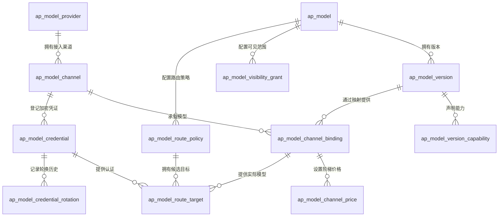

# 模型治理实现与接入说明

本文对应模型与供应商配置改造的实际代码。总体设计见 [模型与供应商治理设计](MODEL_GOVERNANCE_DESIGN.md)。数据库迁移是管理端资源目录下的 `V14__model_governance_normalized_schema.sql`，使用 PostgreSQL，与当前生产配置一致。

## 为什么拆表

供应商代表服务主体，渠道代表具体接入地址，逻辑模型代表平台稳定名称，版本代表模型能力规格。供应商侧模型编码放在渠道映射中，价格随映射变化，凭证属于渠道。这样，一个模型可以使用官方、企业代理和自建部署多个渠道；切换渠道时无需复制模型规格或密钥。



## 已实现的内容

平台内置了一批市面知名供应商与模型目录作为基线数据，Mock 模式与持久化模式同源：25 家供应商、25 条接入渠道、96 个逻辑模型与版本、642 条能力声明、115 条渠道映射、340 条阶梯价格。数据来源、字段口径和维护方式见 [模型目录基线数据说明](MODEL_CATALOG_SEED.md)。

| 配置对象 | 当前能力 |
| --- | --- |
| 供应商 | 创建、分页查询、更新、删除；类型、官网、文档地址、地区、合规标签、业务说明、独立审批状态 |
| 接入渠道 | 创建、分页查询、更新、删除；协议、地址、地区、网络区域、认证、协议配置、超时、网络策略引用 |
| 逻辑模型 | 创建、分页查询、详情、更新、删除；稳定编码、类型、系列、来源、拥有者、说明、元数据 |
| 模型版本 | 创建、查询、更新、删除；版本编码、上下文与输入输出上限、模态、默认参数、废弃时间 |
| 渠道映射 | 创建、查询、更新、删除；上游模型编码、别名、地址覆盖、能力覆盖、权重、优先级、并发限制 |
| 版本能力 | 按能力编码设置或更新、查询；支持标记和能力约束 |
| 阶梯价格 | 创建、查询、删除；计费维度、阶梯、单价、计价单位、币种、生效期 |
| 可见性授权 | 创建、查询、删除；范围、ALLOW/DENY、有效期；当前用于配置存储 |
| 渠道凭证 | 加密登记、脱敏查询、轮换、撤销；指纹去重、有效期、所有权、轮换历史 |
| 路由配置 | 创建、查询、删除策略与目标；锁定版本、范围、选择算法声明、重试、熔断、目标凭证关联 |
| 配置审核 | 独立审核权限入口；检查父配置发布状态后记录发布状态 |

所有仓储读写按当前租户执行；跨租户 ID 不能用于读、写或关联。接口使用统一响应、权限注解和项目现有操作审计。逻辑删除、乐观锁和自动时间填充沿用 `BaseEntity`。

## 代码入口

模型治理模块路径：`hucoo-module/hucoo-module-model-governance/src/main/java/dev/hucoo/modelgovernance/`。

| 层次 | 入口与职责 |
| --- | --- |
| 接口 | `controller/ModelDefinitionController` 管供应商与渠道；`ModelCatalogController` 管规范化目录；`ModelRouteConfigurationController` 管路由配置 |
| 应用服务 | `application/service/ModelProviderChannelService`、`ModelCatalogApplicationService`、`ModelRouteConfigurationService` 统一业务校验与编排 |
| 转换 | `application/converter/ModelCatalogConverter` 使用 MapStruct；凭证 DTO 不包含密文、Nonce 或主密钥信息 |
| 领域 | `domain/entity/` 对应配置表；`ModelConfigurationValidator` 校验枚举、地址和 JSON；`ModelCatalogRepository` 定义租户仓储 |
| 持久化 | `infrastructure/mapper/`、`repository/MybatisModelCatalogRepository`；JSONB 使用 `PostgresJsonTypeHandler` |
| Mock | `repository/InMemoryModelCatalogRepository` 保存深拷贝、隔离租户、支持事务回滚和版本冲突检查 |
| 凭证 | `infrastructure/secret/ModelCredentialCipher` 加密和解密；`config/ModelVaultProperties` 加载主密钥版本 |

## 管理接口

以下路径均位于 `/api/admin/v1`。ID 在响应中按项目约定输出字符串，调用方应避免转换为 JavaScript 数值。

| 方法 | 路径 | 权限 |
| --- | --- | --- |
| GET / POST | `/models/providers` | `model-provider:read/create` |
| PUT / PATCH / DELETE | `/models/providers/{id}` | `model-provider:update/delete` |
| GET / POST | `/models/providers/{providerId}/channels` | `model-channel:read/create` |
| PUT / PATCH / DELETE | `/models/channels/{id}` | `model-channel:update/delete` |
| GET / POST | `/model-catalog/models` | `model:read/create` |
| GET / PUT / DELETE | `/model-catalog/models/{id}` | `model:read/update/delete` |
| GET / POST | `/model-catalog/models/{modelId}/versions` | `model-version:read/create` |
| PUT / DELETE | `/model-catalog/versions/{id}` | `model-version:update/delete` |
| GET / PUT | `/model-catalog/versions/{versionId}/capabilities` | `model-version:read/update` |
| GET / POST | `/model-catalog/versions/{versionId}/bindings` | `model-binding:read/create` |
| PUT / DELETE | `/model-catalog/bindings/{id}` | `model-binding:update/delete` |
| GET / POST | `/model-catalog/bindings/{bindingId}/prices` | `model-price:read/create` |
| DELETE | `/model-catalog/prices/{id}` | `model-price:delete` |
| GET / POST | `/model-catalog/models/{modelId}/grants` | `model-grant:read/create` |
| DELETE | `/model-catalog/grants/{id}` | `model-grant:delete` |
| GET / POST | `/model-catalog/channels/{channelId}/credentials` | `model-key:read/create` |
| POST | `/model-catalog/credentials/{id}/rotate` | `model-key:rotate` |
| POST | `/model-catalog/credentials/{id}/revoke` | `model-key:revoke` |
| POST | `/model-catalog/{resource}/{id}/approve` | `model-config:approve` |
| GET / POST | `/model-catalog/models/{modelId}/route-policies` | `routing:read/create` |
| DELETE | `/model-catalog/route-policies/{id}` | `routing:delete` |
| GET / POST | `/model-catalog/route-policies/{policyId}/targets` | `routing:read/create` |
| DELETE | `/model-catalog/route-targets/{id}` | `routing:delete` |

供应商与渠道的 PATCH 沿用项目完整配置更新约定；前端应提交完整表单。PUT 中可选字段为 null 时清空已保存值。`resource` 只支持 `models`、`versions`、`providers`、`channels`、`bindings`。权限注解不自动给现有角色授权，上线时需配置权限目录与角色授权。

## 接入示例

依次创建供应商、渠道、逻辑模型、版本、渠道映射，再登记凭证、配置价格和路由。下列 ID 为占位值，需要替换为前一步响应中的 ID。JSON 专属字段当前类型为字符串，内部 JSON 需要转义。

1. `POST /models/providers`：

```json
{"providerCode":"enterprise-ai","providerName":"企业模型服务","providerType":"ENTERPRISE","description":"统一企业模型接入"}
```

2. `POST /models/providers/{providerId}/channels`：

```json
{
  "channelCode":"primary-cn",
  "channelName":"国内主渠道",
  "protocolType":"OPENAI_COMPATIBLE",
  "endpoint":"https://models.example.com",
  "basePath":"/v1",
  "region":"cn-east",
  "networkZone":"PUBLIC",
  "authType":"API_KEY",
  "protocolConfigJson":"{\"schemaVersion\":1}",
  "requestTimeoutMs":30000,
  "streamTimeoutMs":60000
}
```

3. `POST /model-catalog/models` 与 `POST /model-catalog/models/{modelId}/versions`：

```json
{"modelCode":"enterprise-chat","modelName":"企业对话模型","modelType":"CHAT","sourceType":"ENTERPRISE"}
```

```json
{"versionCode":"v1","contextWindow":32000,"maxInputTokens":28000,"maxOutputTokens":4000,"inputModalitiesJson":"[\"text\"]","outputModalitiesJson":"[\"text\"]"}
```

4. `POST /model-catalog/versions/{versionId}/bindings`：

```json
{"channelId":"替换为渠道ID","providerModelCode":"upstream-chat-v1","defaultWeight":1,"priority":0,"maxConcurrency":20}
```

5. `POST /model-catalog/channels/{channelId}/credentials`：

```json
{"credentialName":"企业主凭证","credentialType":"API_KEY","secret":"替换为实际凭证","ownerScopeType":"TENANT"}
```

响应包含 `maskedValue=********` 和 `secretFingerprint`，不包含明文、密文、Nonce。轮换用 `POST /model-catalog/credentials/{id}/rotate`，请求字段为 `secret`、`expiresAt`、`reason`。撤销后的凭证不能通过轮换恢复。

6. `POST /model-catalog/bindings/{bindingId}/prices`：

```json
{"billingDimension":"INPUT_TOKEN","tierStart":0,"unitPrice":1.25,"unitScale":1000000,"currency":"CNY","effectiveFrom":"2026-01-01T00:00:00"}
```

数量阶梯是闭区间：`[0,100]` 与 `[100,200]` 重叠，下一档应从 101 开始。时间采用半开区间：前一档的失效时间可以等于后一档的生效时间。价格按映射与维度检查两个区间是否同时重叠；币种不同也不能建立冲突档位。数据库模式在事务内锁定映射行，避免同时新增绕过检查。直接 SQL 写入需遵守相同规则。

7. 创建路由策略与目标：

```json
{"scopeType":"TENANT","selectionAlgorithm":"PRIORITY_WEIGHTED","maxAttempts":3,"enabled":1}
```

策略路径为 `POST /model-catalog/models/{modelId}/route-policies`。

```json
{"bindingId":"替换为映射ID","credentialId":"替换为凭证ID","configuredWeight":1,"status":"DISABLED"}
```

目标路径为 `POST /model-catalog/route-policies/{policyId}/targets`。目标必须属于策略模型及锁定版本，凭证必须属于映射渠道、未撤销且未过期，私有凭证范围必须与路由范围相符。目标默认禁用；本阶段不会因保存策略而改变实际调用行为。

## 状态与变更规则

逻辑模型和版本新建为 `DRAFT`；供应商、渠道、映射新建为 `PENDING_APPROVAL`。审核顺序为供应商 → 渠道、逻辑模型 → 版本，最后审核渠道映射。审核入口写入 `PUBLISHED`。

修改模型或版本重置为 `DRAFT`；修改供应商、渠道、映射重置为 `PENDING_APPROVAL`。修改渠道清除健康时间，修改映射清除验证关联，修改能力重置版本发布状态。修改父配置不会批量改写子配置状态，未来执行器必须逐级检查父配置，不能只看映射状态。凭证轮换清除验证时间，并事务写入轮换历史。

父对象有活跃引用时禁止删除。映射已有路由目标时禁止更换渠道，避免已有目标的凭证落到其他渠道。供应商编码、模型编码和版本编码等使用活跃记录唯一索引，允许逻辑删除后重新登记。删除模型附带删除可见性授权，删除版本附带删除能力声明。

## 凭证主密钥配置

`agent-platform.persistence.enabled=false` 使用内存仓储和随机临时主密钥，配置与凭证随进程退出丢失，适合开发和测试。Mock 与数据库模式共用同一套业务服务。

`enabled=true` 使用 MyBatis-Plus 仓储，并要求配置主密钥。生产配置读取 `HUCOO_MODEL_VAULT_KEY_V1`，其值必须是 **32 字节随机数据的 Base64 编码**，不能是普通口令。缺失或格式错误会阻止持久化模式启动。主密钥应由部署环境的秘密管理服务注入，不写入数据库或版本库。

```yaml
agent-platform:
  persistence:
    enabled: true
  model-governance:
    vault:
      key-id: ${HUCOO_MODEL_VAULT_KEY_ID:model-master}
      active-version: v1
      keys:
        v1: ${HUCOO_MODEL_VAULT_KEY_V1}
```

加密算法为 AES-256-GCM，每次使用独立随机 Nonce，附加认证数据绑定租户与渠道。凭证指纹采用 SHA-256，显示值固定为 `********`，避免短凭证泄露。

主密钥升级到 v2 时，在配置中保留 v1 并新增 v2，再将 `active-version` 改为 v2。新建、轮换的凭证使用 v2；旧凭证按记录中的版本解密。所有旧记录重加密完成前不能删除 v1。当前没有批量重加密任务，主密钥版本变更需要配置后重启。

## 当前边界与后续接入

本次完成控制平面的配置管理，运行时整体切换仍有以下工作：

- 旧 `/models` 模型定义、自定义注册、旧密钥与旧路由接口仍保留。旧表数据不会自动迁移到新目录；反向地，基线种子数据会同步写入 `ap_model_definition`，保证两套读路径看到同一批模型。自定义注册、旧密钥与旧路由接口仍为空实现。
- `ModelInvocationService` 仍使用原内存账户和 SecretStore。此次只修复了跨模型账户 ID 覆盖问题，并使默认 SecretStore 可以被替换；尚未加载新渠道、保险箱或路由目标。
- `PRIORITY_WEIGHTED`、`LOWEST_COST`、`LOWEST_LATENCY` 是可保存的配置声明，新执行算法尚未接入。fallback JSON 尚未进行依赖环检测。
- 可见性授权当前只管理记录，尚未成为实际调用的授权判定；平台目录跨租户共享与项目、用户归属需要执行器和对应 Facade 接入。
- 配置审核是独立权限入口，尚未复用身份模块的多级审批流；写入发布状态不代表模型已经通过连通性、流式、工具调用等真实验证。
- Endpoint 校验检查地址格式并禁止 URL 中的认证信息、查询参数与片段；网络策略 ID、网络区域是配置引用，尚未执行 DNS/CIDR 检查、SSRF 防护或出网代理策略。
- 支持登记协议类型不代表已完成各供应商协议适配。认证凭证按字符串加密，OAuth 刷新与 mTLS 证书管理尚未实现。
- 配置列表当前按租户加载后过滤分页。大规模配置需要增加仓储条件查询和数据库分页。

运行时切换应通过 `api/` 中独立 Facade 契约完成，禁止模型运行时模块直接依赖模型治理业务实现。切换前应补充真实验证结果的持久化、逐级发布准入、授权解析、保险箱调用、审计和失败恢复测试；旧表清理安排在验证通过后的独立迁移中。

## 验证

2026-10-05 已完成 `./mvnw -q clean install`：构建成功，测试共 119 项，失败 0、错误 0、跳过 9。模型目录业务测试 13 项、管理端目录接口测试 3 项均通过；另有 JSONB 参数绑定与运行时账户 ID 回归测试。已静态核对 V14 新建表和扩展字段的中文注释，无缺漏。

2026-10-06 补充基线数据后的回归：模块测试 19 项（含新增 `ModelCatalogSeedLoaderTest` 5 项）、管理端 `AdminApplicationTests` 10 项与 `ModelCatalogApiTests` 3 项全部通过。`V15__seed_model_catalog.sql` 已通过静态校验：8 张表 INSERT 的行列数一致、引号闭合、所有 `::jsonb` 字面量可解析、列名与 V1/V3/V14 的 DDL 完全对应。

业务测试覆盖租户隔离、重复编码、协议与秘密校验、发布状态失效、价格时间与数量区间、并发价格登记、凭证加密与防篡改、轮换事务、错误路由绑定。管理端 MockMvc 测试覆盖完整配置创建与查询、凭证脱敏和 OpenAPI 路径装配。JSONB 类型处理测试确认参数按 PostgreSQL 的 OTHER 类型绑定。种子数据测试覆盖装载数量、供应商与渠道字段、协议配置不含密钥、旧版影子表无占位示例数据、跨租户不可见以及重复装载不产生重复目录。

数据库环境限制：当前 Docker 服务未运行，本次未在真实 PostgreSQL 上执行 Flyway V14，也未进行数据库模式的端到端测试；Mock 和单元测试通过不能替代这一验证。上线前需在独立 PostgreSQL 数据库执行 V1～V14、检查中文注释与约束，并完成持久化接口和并发价格检查。
