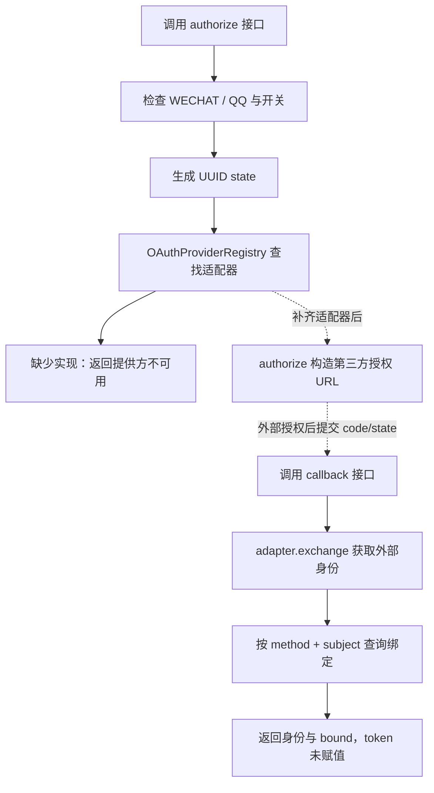

# OAuth2 相关代码与实现梳理

本文按当前后端源码整理，覆盖第三方登录、平台令牌与鉴权、集成应用配置及模型凭证类型。代码目录以当前仓库的 `hucoo-module/`、`hucoo-component/`、`hucoo-server/` 为准。

## 1. 当前实现程度

项目已定义微信、QQ 第三方登录的接口和适配器契约，但尚未完成真实 OAuth2 登录闭环。

| 范围 | 当前实现 | 边界 |
| --- | --- | --- |
| 微信 / QQ 登录 | 授权地址接口、回调接口、提供方注册表、外部身份查询 | 未找到具体 `OAuthProviderAdapter` 实现，无法实际向第三方交换授权码 |
| Mock 第三方登录 | 构造模拟授权 URL 和外部身份 | 不访问微信 / QQ，不签发平台登录令牌 |
| 平台认证 | 登录、JWT access token、refresh token 轮换、会话撤销 | 属于项目自定义认证；尚未接入 OAuth 回调 |
| 集成应用 | `oauthClientId` 字段及应用 CRUD | 未找到完整授权、交换令牌、续期和撤销实现 |
| 模型治理 | 允许登记 `OAUTH2` 认证 / 凭证类型 | 类型登记不等于实现 OAuth2 token 获取和刷新 |

后端 POM 中未找到 Spring Security OAuth2 Client、Resource Server、Authorization Server 的直接依赖，也未找到对应的 `SecurityFilterChain` / `oauth2Login` 配置。当前代码采用自定义应用服务、JWT 工具和 MVC 拦截器。

## 2. 代码导航

### 2.1 第三方登录：identity 模块

Java 根目录：`hucoo-module/hucoo-module-identity/src/main/java/dev/hucoo/identity/`。

| 文件 | 职责 / 关键方法 |
| --- | --- |
| [AuthenticationController](../hucoo-module/hucoo-module-identity/src/main/java/dev/hucoo/identity/controller/AuthenticationController.java) | REST 入口；`oauthAuthorize` 从第 80 行开始，`oauthCallback` 从第 88 行开始 |
| [AuthenticationFacade](../hucoo-module/hucoo-module-identity/src/main/java/dev/hucoo/identity/api/AuthenticationFacade.java) | 对外认证契约 |
| [AuthenticationApplicationService](../hucoo-module/hucoo-module-identity/src/main/java/dev/hucoo/identity/application/auth/AuthenticationApplicationService.java) | 应用服务接口，继承认证 Facade |
| [AuthenticationApplicationServiceImpl](../hucoo-module/hucoo-module-identity/src/main/java/dev/hucoo/identity/application/auth/AuthenticationApplicationServiceImpl.java) | 数据库模式编排；授权第 184 行、回调第 203 行、普通登录第 142 行 |
| [OAuthProviderAdapter](../hucoo-module/hucoo-module-identity/src/main/java/dev/hucoo/identity/application/auth/OAuthProviderAdapter.java) | 定义提供方标识、授权地址构造、授权码交换 |
| [OAuthProviderRegistry](../hucoo-module/hucoo-module-identity/src/main/java/dev/hucoo/identity/application/auth/OAuthProviderRegistry.java) | 按 `AuthenticationMethod` 选择 Spring 注入的适配器 |
| [MockAuthenticationApplicationService](../hucoo-module/hucoo-module-identity/src/main/java/dev/hucoo/identity/application/auth/mock/MockAuthenticationApplicationService.java) | 内存模式；模拟授权第 178 行、模拟回调第 192 行 |
| [AuthenticationProperties](../hucoo-module/hucoo-module-identity/src/main/java/dev/hucoo/identity/config/AuthenticationProperties.java) | `agent-platform.authentication` 配置：认证方式开关、令牌有效期等 |
| [AuthenticationMethod](../hucoo-module/hucoo-module-identity/src/main/java/dev/hucoo/identity/domain/auth/enums/AuthenticationMethod.java) | `PASSWORD`、`SMS`、`EMAIL`、`WECHAT`、`QQ` |
| [AuthLoginIdentity](../hucoo-module/hucoo-module-identity/src/main/java/dev/hucoo/identity/domain/auth/entity/AuthLoginIdentity.java) | 用户与登录身份映射；第三方身份使用 `providerSubject` |
| [AuthLoginIdentityMapper](../hucoo-module/hucoo-module-identity/src/main/java/dev/hucoo/identity/infrastructure/auth/mapper/AuthLoginIdentityMapper.java) | `selectByProviderSubject(method, subject)` 查询绑定关系 |

接口 DTO：

- [AuthOAuthAuthorizeResponse](../hucoo-module/hucoo-module-identity/src/main/java/dev/hucoo/identity/api/dto/AuthOAuthAuthorizeResponse.java)：`provider`、`authorizationUrl`、`state`。
- [AuthOAuthCallbackRequest](../hucoo-module/hucoo-module-identity/src/main/java/dev/hucoo/identity/api/dto/AuthOAuthCallbackRequest.java)：必填 `code`、`state`，另有 `clientId`（默认 `ADMIN_CONSOLE`）、`tenantId`、`deviceId`。
- [AuthOAuthCallbackResponse](../hucoo-module/hucoo-module-identity/src/main/java/dev/hucoo/identity/api/dto/AuthOAuthCallbackResponse.java)：`provider`、`subject`、`displayName`、`email`、`bound`、`token`。当前两个实现均未给 `token` 赋值。

### 2.2 配置与运行模式

配置位置：

- [application.yml](../hucoo-server/hucoo-application-admin/src/main/resources/application.yml)：默认激活 `dev`；认证配置从第 131 行附近开始。
- [application-dev.yml](../hucoo-server/hucoo-application-admin/src/main/resources/application-dev.yml)：覆盖 `agent-platform.persistence.enabled=true`。
- [application-test.yml](../hucoo-server/hucoo-application-admin/src/main/resources/application-test.yml)：`persistence.enabled=false`。
- [application-prod.yml](../hucoo-server/hucoo-application-admin/src/main/resources/application-prod.yml)：数据库模式，安全权限校验开启，第三方认证通过环境变量控制。

基础配置中的第三方认证默认值：

```yaml
agent-platform:
  authentication:
    enabled: true
    access-token-ttl-minutes: 20
    refresh-token-ttl-days: 30
    providers:
      password: true
      sms: false
      email: false
      wechat: false
      qq: false
```

生产配置使用 `HUCOO_AUTH_WECHAT_ENABLED` 和 `HUCOO_AUTH_QQ_ENABLED`，两者默认也是 `false`。

`persistence.enabled=true` 选择 `AuthenticationApplicationServiceImpl`；`false` 或缺少该属性时选择 Mock 实现。基础配置为 `false`，但当前默认启动的 `dev` profile 会覆盖为 `true`，因此默认启动实际走数据库实现。

现有 `AuthenticationProperties` 没有微信 / QQ 的 app secret、授权端点、token 端点、回调白名单配置。仅开启提供方开关，不能完成接入。

## 3. 第三方登录接口怎样工作

所有接口都返回统一的 `Result<T>`。

| 方法 | 路径 | 输入 | 当前输出 |
| --- | --- | --- | --- |
| GET | `/api/admin/v1/auth/providers` | 无 | 各认证方式的配置开关；不检测适配器是否真正就绪 |
| GET | `/api/admin/v1/auth/oauth/{provider}/authorize` | 路径 `provider`；查询参数 `clientId`、`redirectUri` | 提供方、授权 URL、state |
| POST | `/api/admin/v1/auth/oauth/{provider}/callback` | 路径 `provider`；JSON `code`、`state` 等 | 外部身份和是否已绑定；当前不返回有效登录 token |

`provider` 解析时会去除首尾空格并转成大写，仅允许 `WECHAT`、`QQ`。例如 `wechat` 会解析为 `WECHAT`。

### 3.1 获取授权地址

数据库实现的执行顺序：

1. 解析 `provider`，拒绝非微信 / QQ 的认证方式。
2. 检查 `providers` 中的对应开关；关闭时抛出 `AUTHENTICATION_METHOD_DISABLED`（业务码 `110005`）。
3. 使用 `IdGenerator.uuid()` 生成 `state`。
4. 调用 `oauthProviderRegistry.require(method)` 查找具体适配器。
5. 调用适配器的 `authorize(clientId, redirectUri, state)`，将 URL 与 state 返回给调用方。

核心调用是：

```java
String state = IdGenerator.uuid();
String authorizationUrl = oauthProviderRegistry.require(method)
        .authorize(clientId, redirectUri, state);
```

注册表构造时收集 Spring 注入的 `List<OAuthProviderAdapter>`，形成 `Map<AuthenticationMethod, OAuthProviderAdapter>`。找不到适配器时抛出 `AUTH_PROVIDER_UNAVAILABLE`（业务码 `110012`）。当前仓库没有具体适配器，所以数据库模式即使打开开关，也会停在这一步。

### 3.2 处理回调

数据库实现的执行顺序：

1. Controller 使用 `@Valid` 检查 `code` 和 `state` 非空。
2. 应用服务检查 provider 类型和开关。
3. 调用 `adapter.exchange(code, state)`，期望得到统一的 `ExternalIdentity`。
4. 使用 `(method, external.subject())` 查询 `ap_auth_login_identity`。
5. 返回外部身份信息，`bound` 仅表示查到了身份记录。

核心调用是：

```java
OAuthProviderAdapter.ExternalIdentity external = oauthProviderRegistry.require(method)
        .exchange(request.getCode(), request.getState());
AuthLoginIdentity identity = loginIdentityMapper
        .selectByProviderSubject(method.name(), external.subject());
```

此方法没有调用 `tokenService.issue(...)`，没有创建用户或写入绑定关系，也没有使用回调请求中的 `clientId`、`tenantId`、`deviceId`。即使查到已绑定身份，当前也不会完成平台登录。

回调入口是 POST JSON；现有代码没有接收第三方浏览器 GET 重定向的 Controller。接入时需明确由前端接收第三方重定向后转交 `code/state`，还是新增后端重定向处理入口。

### 3.3 当前流程图



### 3.4 Mock 实现

Mock 不使用 `OAuthProviderRegistry`，检查提供方开关后直接构造：

```text
授权 URL：https://mock.wechat.local/oauth/authorize?client_id=...&redirect_uri=...&state=...
subject：mock-wechat-{code}
displayName：Mock WECHAT
email：{subject}@mock.local
```

QQ 使用相同逻辑，替换提供方名称。`bound` 查询内存 `identifiers`，`token` 同样未赋值。模拟 URL 只用于接口占位，不能用于真实授权。

## 4. 外部身份如何落库

[V9__authentication_identity_schema.sql](../hucoo-server/hucoo-application-admin/src/main/resources/db/migration/V9__authentication_identity_schema.sql) 的 `ap_auth_login_identity` 从第 16 行开始：

| 字段 | 用途 |
| --- | --- |
| `user_id` | 平台用户 ID |
| `method` | 登录方式，例如 `WECHAT`、`QQ` |
| `identifier` | 普通账号标识 |
| `provider_subject` | 第三方身份的稳定唯一标识，具体含义需由适配器确定 |
| `verified_at` / `status` | 验证时间和身份状态 |
| `tenant_id` | 身份记录归属 |

数据库声明了 `(method, identifier)` 和 `(method, provider_subject)` 两组唯一约束。Mapper 的第三方查询条件为 `method`、`provider_subject`、`deleted=0`，没有显式筛选身份状态；回调应用服务也只判断查询结果是否非空。

## 5. 平台令牌与接口鉴权

第三方 provider 的 access token 与 Hucoo 自身的 access token 是不同的凭证。当前项目的平台令牌实现可供后续 OAuth 登录闭环复用。

| 文件 | 当前职责 |
| --- | --- |
| [TokenServiceImpl](../hucoo-module/hucoo-module-identity/src/main/java/dev/hucoo/identity/application/auth/TokenServiceImpl.java) | 第 40 行 `issue` 创建刷新会话；第 52 行 `refresh` 轮换；第 145 行构造令牌响应 |
| [JwtUtil](../hucoo-component/hucoo-component-security/src/main/java/dev/hucoo/component/security/util/JwtUtil.java) | 第 32 行签发 HS256 JWT；第 48 行解析并检查签名及数值型 `exp` |
| [PermissionInterceptor](../hucoo-component/hucoo-component-security/src/main/java/dev/hucoo/component/security/interceptor/PermissionInterceptor.java) | 第 49 行解析 Authorization、设置用户 / 租户上下文、执行权限校验 |
| [DatabasePermissionResolver](../hucoo-module/hucoo-module-identity/src/main/java/dev/hucoo/identity/config/DatabasePermissionResolver.java) | 通过 `PermissionCache` 获取当前用户在租户中的权限 |
| [SecurityProperties](../hucoo-component/hucoo-component-security/src/main/java/dev/hucoo/component/security/config/SecurityProperties.java) | JWT 密钥、安全开关和匿名路径；`/api/admin/v1/auth/oauth/**` 在忽略列表中 |
| [AuthGlobalFilter](../hucoo-server/hucoo-gateway-server/src/main/java/dev/hucoo/gateway/filter/AuthGlobalFilter.java) | 网关检查令牌是否存在；不执行 JWT 签名校验或 OAuth token introspection |
| [GatewayAuthProperties](../hucoo-server/hucoo-gateway-server/src/main/java/dev/hucoo/gateway/config/GatewayAuthProperties.java) | 网关鉴权默认关闭，`/api/admin/v1/auth/**` 默认放行 |

普通数据库登录链路：

```text
POST /auth/login
  → LoginAuthenticatorRegistry.authenticate(...)
  → 查询平台用户和有效租户成员关系
  → 检查请求的租户属于该用户
  → TokenServiceImpl.issue(...)
  → 返回 accessToken + refreshToken
```

当前提供了密码、短信验证码、邮件验证码认证器，未找到微信 / QQ 的 `LoginAuthenticator`。因此把 `/auth/login` 的 `method` 改为 `WECHAT` 也不会自动复用 OAuth 回调完成登录。

平台 JWT 包含 `userId`、`username`、`tenantId`、`clientId`、`sessionId`、`tokenVersion`，以及 `sub`、`iat`、`exp`。签名密钥和 `kid` 来自 `SecurityProperties`；`AuthenticationProperties` 也声明了 `jwtKeyId`，但 `TokenServiceImpl` 使用注入的 `JwtUtil`，其配置来源是安全组件。

数据库 refresh token 使用随机串，持久化 SHA-256 摘要到 `ap_auth_refresh_session`。刷新时撤销旧会话、创建同一 token family 的新会话；检测到复用已撤销令牌时撤销整个 family。表结构见 [V10__authentication_session_schema.sql](../hucoo-server/hucoo-application-admin/src/main/resources/db/migration/V10__authentication_session_schema.sql)。

后续请求携带 `Authorization: Bearer <accessToken>`。MVC 拦截器解析 token 并设置 `CurrentUserContext`、`CurrentTenantContext`；安全开关开启且接口标注 `@RequirePermission` 时校验权限。安全开关关闭时，非忽略路径上携带的 token 仍会被解析。不能把该开关理解为对每一个接口都强制登录。

注销和会话撤销主要针对 refresh session；当前 `JwtUtil` / `PermissionInterceptor` 没有按 JWT 的 `sessionId` 查询会话是否已撤销，所以不能据此认定已签发 access token 会立即失效。

## 6. 其他 OAuth 相关代码

### 集成应用

[IntegrationApp](../hucoo-module/hucoo-module-integration/src/main/java/dev/hucoo/integration/domain/entity/IntegrationApp.java) 第 29 行将 `oauthClientId` 映射到 `ap_integration_app.oauth_client_id`，创建请求和返回 DTO 也包含该字段。

[IntegrationAppController](../hucoo-module/hucoo-module-integration/src/main/java/dev/hucoo/integration/controller/IntegrationAppController.java) 提供 `/api/admin/v1/integrations` 的 CRUD，以及 `/connections`、`/webhooks` 列表别名。这里登记的是集成应用元数据，尚未找到基于该字段执行 OAuth 授权码交换或刷新令牌的代码。

### 模型治理

- [ModelProviderChannelService](../hucoo-module/hucoo-module-model-governance/src/main/java/dev/hucoo/modelgovernance/application/service/ModelProviderChannelService.java) 允许渠道 `authType=OAUTH2`。
- [ModelCatalogApplicationService](../hucoo-module/hucoo-module-model-governance/src/main/java/dev/hucoo/modelgovernance/application/service/ModelCatalogApplicationService.java) 允许凭证 `credentialType=OAUTH2`。
- [OpenAiCompatibleAdapter](../hucoo-module/hucoo-module-model-runtime/src/main/java/dev/hucoo/modelruntime/infrastructure/adapter/OpenAiCompatibleAdapter.java) 对传入 secret 使用 `Authorization: Bearer ...` 调用模型；该调用本身不执行 OAuth 授权和 token 续期。

## 7. 完成真实第三方登录还需要什么

以下是从当前实现推导的后续工作，均不是已实现功能：

1. 为微信、QQ 实现 `OAuthProviderAdapter`，完成授权 URL 构造、授权码换 token、获取稳定 subject，并增加对应的服务端配置与凭证管理。
2. 保存带有效期的授权上下文，将 state 与 provider、客户端、redirect URI、设备等绑定；回调校验并一次性消费。当前服务层只生成 / 传递 state，未实现保存、匹配和过期校验，Mock 回调也不校验 state 的关联性。
3. 校验客户端和 redirect URI 的允许范围，明确请求 `clientId` 是平台客户端标识还是第三方应用标识；当前授权方法直接把请求参数交给适配器。
4. 补齐身份绑定 / 未绑定账号处理策略；绑定操作应要求已验证的平台身份，避免仅凭外部资料误绑定。
5. 已绑定身份登录时检查身份状态、平台用户状态、租户成员关系和客户端策略，再复用 `TokenService.issue` 填充回调响应的 `token`。
6. 给第三方登录成功、失败、绑定和解绑增加审计。当前普通登录会调用 `publishAudit`，OAuth 授权和回调方法没有对应调用。
7. 补齐提供方超时 / 错误处理和 OAuth 测试，包括 state 不匹配、过期 / 重放、绑定状态、禁用用户、租户越权和令牌签发。

## 8. 现有验证与阅读顺序

[AuthenticationApiTests](../hucoo-server/hucoo-application-admin/src/test/java/dev/hucoo/admin/AuthenticationApiTests.java) 覆盖 Mock 模式认证接口、密码登录、JWT 访问 `/auth/me`、刷新和退出；不覆盖真实微信 / QQ OAuth 流程。

[PermissionInterceptorTest](../hucoo-component/hucoo-component-security/src/test/java/dev/hucoo/component/security/PermissionInterceptorTest.java) 验证权限和租户访问；[LoginAuthenticatorRegistryTest](../hucoo-module/hucoo-module-identity/src/test/java/dev/hucoo/identity/application/auth/LoginAuthenticatorRegistryTest.java) 验证认证器注册与选择。

推荐阅读顺序：`AuthenticationController` → `AuthenticationApplicationServiceImpl` 的两个 OAuth 方法 → `OAuthProviderAdapter` / `OAuthProviderRegistry` → `AuthLoginIdentityMapper` → `TokenServiceImpl` → `PermissionInterceptor`。联调内存模式时再对照 Mock 实现。

本次仅新增代码梳理文档，核对源码、配置和文件链接，未修改认证逻辑，未运行 Maven 测试。
